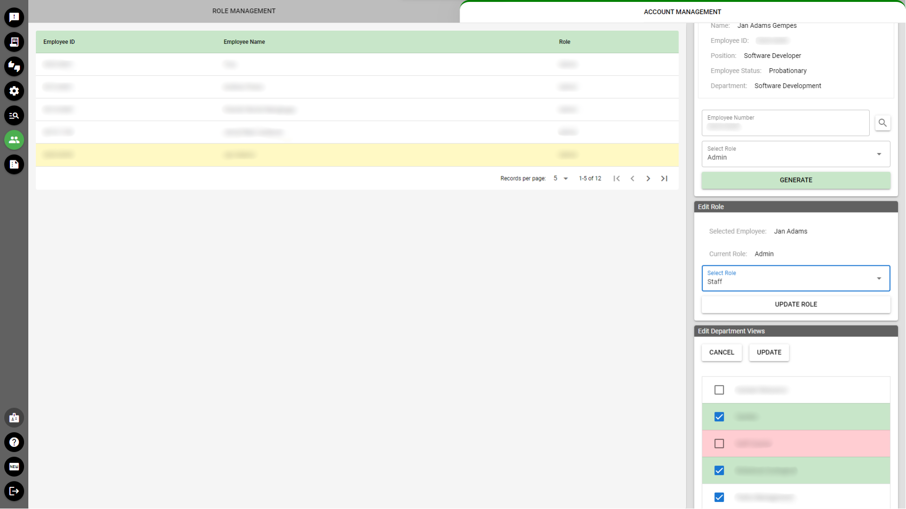
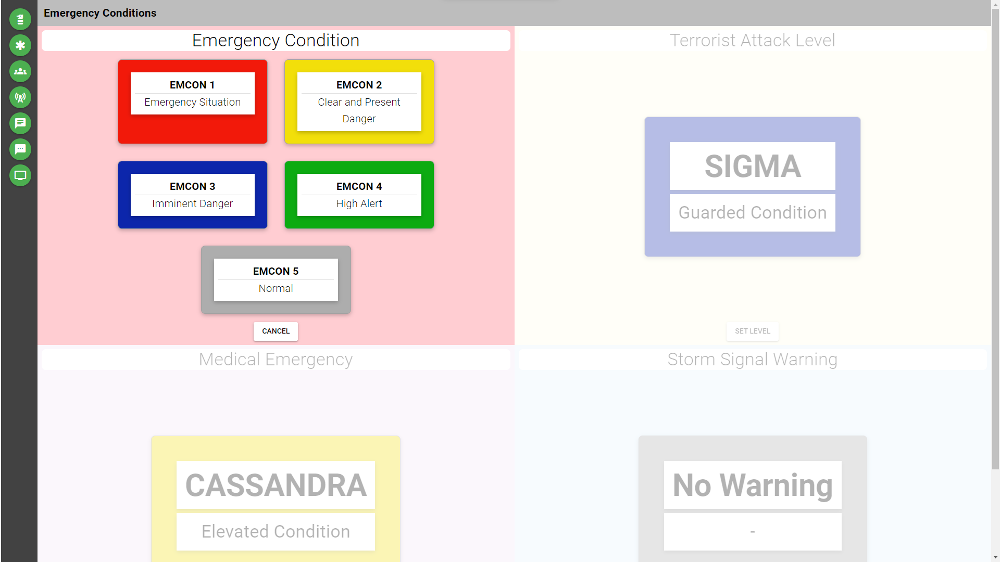

- [Account Management System](#account-management-system)
  - [Description ](#description-)
  - [Functions](#functions)
    - [Account Data](#account-data)
    - [Permission Data](#permission-data)
    - [Security Logging](#security-logging)
  - [Work Done](#work-done)
  - [Tech Stack](#tech-stack)
  - [Screenshots](#screenshots)
- [BCC Member's App Backend](#bcc-members-app-backend)
  - [Link](#link)
  - [Description ](#description--1)
  - [Functions](#functions-1)
    - [*Static Data Endpoints*](#static-data-endpoints)
    - [*Reservation Endpoints*](#reservation-endpoints)
    - [*File Handling*](#file-handling)
    - [*Account Management*](#account-management)
    - [*Realtime Chat*](#realtime-chat)
    - [*Logging, Data Visualization, and Analysis*](#logging-data-visualization-and-analysis)
    - [*Security*](#security)
  - [Work Done](#work-done-1)
  - [Tech Stack](#tech-stack-1)
  - [Screenshots](#screenshots-1)
- [BCC Member's App Chat - Admin CMS](#bcc-members-app-chat---admin-cms)
  - [Description ](#description--2)
  - [Functions](#functions-2)
    - [Typical Chat Application Functionalities](#typical-chat-application-functionalities)
    - [Ticket Creation](#ticket-creation)
    - [Data Search](#data-search)
  - [Work Done](#work-done-2)
  - [Tech Stack](#tech-stack-2)
  - [Screenshots](#screenshots-2)
- [Incidents CMS](#incidents-cms)
  - [Description ](#description--3)
  - [Functions](#functions-3)
    - [*Data Entry for Incidents*](#data-entry-for-incidents)
    - [*Data Entry for Feedback*](#data-entry-for-feedback)
    - [*Timeline View*](#timeline-view)
    - [*Data Graphs*](#data-graphs)
    - [*Help System*](#help-system)
  - [Work Done](#work-done-3)
  - [Tech Stack](#tech-stack-3)
  - [Screenshots](#screenshots-3)
- [Event Scoring Backend](#event-scoring-backend)
  - [Link](#link-1)
  - [Description ](#description--4)
  - [Functions](#functions-4)
    - [*CRUD*](#crud)
  - [Work Done](#work-done-4)
  - [Tech Stack](#tech-stack-4)
  - [Event pictures](#event-pictures)
- [Image / File Processing System](#image--file-processing-system)
  - [Description ](#description--5)
  - [Functions](#functions-5)
    - [*File Serving*](#file-serving)
    - [*Image Processing*](#image-processing)
    - [*Meta-data Endpoint*](#meta-data-endpoint)
  - [Work Done](#work-done-5)
  - [Tech Stack](#tech-stack-5)
- [Emergency Display and Reporting System](#emergency-display-and-reporting-system)
  - [Description ](#description--6)
  - [Functions](#functions-6)
    - [Emergency Display](#emergency-display)
    - [Desktop Page](#desktop-page)
    - [Content Management System](#content-management-system)
    - [SMS Notifications](#sms-notifications)
  - [Work Done](#work-done-6)
  - [Tech Stack](#tech-stack-6)
  - [Screenshots](#screenshots-4)
- [Project Management](#project-management)
  - [Description ](#description--7)
  - [Functions](#functions-7)
    - [*Executive View*](#executive-view)
    - [*Projects Page*](#projects-page)
    - [*Tasks Page*](#tasks-page)
    - [*Project / PR Notifications*](#project--pr-notifications)
    - [*Mentions*](#mentions)
  - [Work Done](#work-done-7)
  - [Tech Stack](#tech-stack-7)
  - [Screenshots](#screenshots-5)
- [Smart Room 360 Degree View](#smart-room-360-degree-view)
  - [Link](#link-2)
  - [Description ](#description--8)
  - [Work Done](#work-done-8)
  - [Tech Stack](#tech-stack-8)
  - [Screenshots](#screenshots-6)
- [Waiver Management System](#waiver-management-system)
  - [Description ](#description--9)
  - [Functions](#functions-8)
    - [Digital Form](#digital-form)
    - [Document Generation](#document-generation)
  - [Work Done](#work-done-9)
  - [Tech Stack](#tech-stack-9)
  - [Screenshots](#screenshots-7)
- [University - Guidance Records Management System](#university---guidance-records-management-system)
  - [Description ](#description--10)
  - [Features](#features)
    - [Information Search and Update](#information-search-and-update)
    - [PDF Generation](#pdf-generation)
  - [Tech Stack](#tech-stack-10)
  - [Screenshots](#screenshots-8)
- [University - Digital Signals Simulation System](#university---digital-signals-simulation-system)
  - [Description ](#description--11)
  - [Tech Stack](#tech-stack-11)
  - [Screenshots](#screenshots-9)
- [Phil. Navy - Crisis Simulation Game](#phil-navy---crisis-simulation-game)
  - [Description ](#description--12)
  - [Functions](#functions-9)
    - [Main Map Logic](#main-map-logic)
    - [Game Objectives Overview](#game-objectives-overview)
    - [Game Master Decision Page](#game-master-decision-page)
  - [Work Done](#work-done-10)
  - [Tech Used](#tech-used)
  - [Code Example](#code-example)
  - [Screenshots](#screenshots-10)


```
> A neutrino walks through a bar. 
```
# Account Management System

## Description 


In the beginning, the setup for account management was decentralized, with each IT system having its own login credentials. As the number of systems grew, managing these credentials became increasingly unwieldy. To address this issue, a single-sign-on (SSO) solution was implemented, which would allow users to access multiple systems using a single set of credentials.

The SSO solution was designed with the concept of Role-based Access Control (RBAC) in mind. RBAC is a method of controlling access to resources based on a user's role within an organization. The system was designed to be flexible and granular, allowing for specific permissions to be assigned to individual users.    

## Functions
### Account Data
- Create/delete accounts
- Map roles and user permissions to accounts and applications

### Permission Data
- Create applications and modules that they are comprised of
- Create/delete actions that a user can perform
- Create roles and map them to applications / modules
- Map permissions to roles and actions

### Security Logging
- Log certain events for monitoring and security audit purposes

## Work Done
- `DB design` - Designed database schema and created entity-relationship chart to ensure efficient data storage and relationships.
- `Interview` - Collaborated with team members to gather requirements and ensure system met business needs.
- `Development`
  - Developed backend code and tested thoroughly to ensure functionality, reliability, and performance.
  - Created database, tables, views, and stored procedures
- `Documentation` - Created comprehensive API documentation to facilitate future development and integration.
- `Deployment` - Successfully deployed system to production environment.
- `Support` - Provided training and support to team members to ensure successful adoption and usage of the system.
- `Updating` -  Assimilated system with existing systems to create a seamless user experience.
- `Security audit` - Periodically check the logs for any unusual events.


## Tech Stack
-  
- 
- 
- **pino** + **prometheus** + **grafana loki** - logging, visualization, and data analysis
- **grafana k6** + **locust.py** - load testing
- **JSON web tokens** - authentication base
- **bcrypt** - password hashing


## Screenshots
> This is a frontend implementation on one of my projects. 
>
>


```
>  Jurisprudence fetishist gets off on technicality. 
```
# BCC Member's App Backend

## Link

- [Google Play](https://play.google.com/store/apps/details?id=com.bcc.member_app&hl=en_US)

## Description 

The backend server for Baguio Country Club's mobile app. Biggest project yet.

## Functions
### *Static Data Endpoints*
- Display static data related to the club (*ex. events and facilities*) and the user's membership (*ex. membership data and account balances*).
- Display weather and road conditions. Weather data is pulled from an external API

### *Reservation Endpoints*
- Create and cancel reservations on various club facilities, and view history
- Dynamically cancel expired reservations

### *File Handling*
- Accept image uploads and perform post-processing for space optimization (*via conversion to WebP and size scaling*)
- Batch-process files from the finance department and map each to certain tables in the database
- Serve images and documents

### *Account Management*
- Issue accounts and change passwords
- Handle OTP storage, processing, and sending

### *Realtime Chat*
- Track active clients eligible for bidirectional data transfer and send data via sockets protocol

### *Logging, Data Visualization, and Analysis*
- Store logs and various data that are used for metric analysis and report generation

### *Security*
- Handle identity generation and authentication
- Prevent data from being accessed by an authorized entity (*ex. a member's account statement being seen by another member*)

## Work Done
- `Design`
  - Reviewed code of initial proof-of-concept server written in PHP and developed by a separate duo of programmers
  - Collaborated with frontend developer to design backend structure, with guidance from existing server
  - Designed database schema and created entity-relationship charts to ensure efficient data storage and relationships
  - Designed login and OTP process to ensure secure user authentication
  - Finalized overall server architecture
- `Interviews/Presentations`
  - Conducted manager interviews to gather requirements and ensure system met business needs.
  - Presented the design and system functionalities to managers to gather additional feedback.
- `Development`
  - Developed new server in Typescript, in concert with the frontend developer integrating the endpoints, and conducting continous testing to ensure endpoint functionality and data integrity, including:
    - data validation and error handling
    - data security and access control
    - data backup and recovery procedures
  - Created environments for development and testing purposes
  - Created database, tables, views, and stored procedures
- `Deployment`
  - Setup DNS records and security certificates
  - Redeployed server code and migrated database from old machine to a new one
- `Testing` - Continuous testing to ensure response and load-handling capabilities
- `Documentation` - Documented system's design and inner workings, as well as API endpoints, to ensure transparency and ease of maintenance
- `Security` - Implemented security measures to adhere to industry standards and reduce potential attack vectors
- `Collaboration` - Collaborated with Finance department to generate monthly documents for each member and process them through the database
- `Maintenance`
  - Monitored and maintained server upkeep, fixing bugs and addressing issues as they arise
  - Update code in response to each requirement addition and policy changes
- `Security audit` - Periodically check the logs for any unusual events.

## Tech Stack
- Backend
  -  
  - 
  - **pm2** - backend monitoring and parallelization (*via clustering*)
- Data Storage
  - 
  -  
- Testing
  - **mocha** + **supertest** + **chai** - endpoint testing
  - **grafana k6** + **locust.py** - load testing
- Logging
  - **pino** + **prometheus** + **grafana loki** - logging, visualization, and data analysis
- Utilities
  - 
  -  - batch processing of files (*ex. file renaming, PDF manipulation via PyMuPDF*)
  - **sharp** + **multer** - image processing
  - **cron** - run scheduled jobs
  - **draw.IO** - generate ERD charts
  - **MermaidJS** - generate charts to visualize data flow and backend design
  - **Docker** + **Uptime Kuma** - backend health monitor tool and notification service

## Screenshots

> Early design for the reservation flow (not the actual implementation). Sequence diagrams such as these served as the bread-and-butter to communicate design flows and choices to other developers.
 


> This is the preliminary design of the backend, which is not representative of the actual implementation of code and flow of data. Pertinent security objects are blurred for safety.
> 
>

```
>  What if soy milk is just regular milk introducing itself in Spanish.
```

# BCC Member's App Chat - Admin CMS

## Description 

The project involves the development of a comprehensive system designed to administer chat messages for sent from the BCC Member's App, enhancing both user interaction and administrative oversight. This system is structured to facilitate real-time communication among users while providing administrators with robust tools to monitor and manage the conversation flow. Key features include an intuitive interface for viewing and sorting messages, and user management capabilities such as ticket creation to track incident events and feedbacks from the members.

## Functions
### Typical Chat Application Functionalities
- View, edit, delete, and send messages
- Tag and filter conversations (mostly used for administrator assignment)
- View information about the member; create notes
- Send, and receive images
### Ticket Creation
- This system connects to two systems, the incident system and the requests system
- The administrator creates a ticket attached with pertinent chat messages about a certain incident or request, and forwards it to any of the two systems for further processing.


> Flowchart of systems
> 
### Data Search
- Implemented robust search functionality for tickets and chat messages, enabling efficient retrieval and analysis of interactions. 
  

## Work Done
- `DB design` - Designed and implemented a comprehensive database schema, including an entity-relationship chart, to effectively manage and store data for the new system.
- `Interviews` - Conducted thorough interviews with managers to gather requirements and ensure that the system meets their needs. 
- `Development` - 
- Developed and tested the backend, frontend, database, and API documentation to ensure seamless functionality and user experience.
- `Support` - Provideed training and support to operators on the system's capabilities and usage, and deploy the system to production
- `Maintenance` - Addressed bugs and rolled out updates and feature requests to enhance functionality and performance.


## Tech Stack
-  
- 
-  
- 
- **lottie** - animations
- **pinia** - data management
- **axios** - API communication
- **driverJS** - help system
- **socketIO-client** - communicate socket data with the backend
  

## Screenshots
>

```
> I need constant reassurance, right?
```
# Incidents CMS
## Description 
The Incident Management System was designed to complement the BCC App Chat Admin CMS, providing a centralized platform for managing and tracking incidents reported by chat members. The system was initially developed to allow chat admins to create tickets from member chats, describing incidents that required attention. Subsequently, the system was enhanced to enable CMS operators to log incident reports directly into the system, without the need for tickets from the chat admin.

## Functions
### *Data Entry for Incidents*
- The operator can log an incident, whether with a supporting chat ticket from the member's app or not. Additional event details can be included, such as cost of damages, injured persons, response made, etc. Pictures and files can be attached as well.
- The system allows for easy searching and filtering of incidents, enabling the operator to quickly locate specific incidents and view their details and status.
### *Data Entry for Feedback*
- Commendations, suggestions, and complaints can be logged here, whether with a supporting chat ticket or not. Associated employees can be notified as well, as part of the planned Employees App.
### *Timeline View*
- A timeline of events per incident can also be viewed, to show a visual chronological progression of events. A higher level timeline, that which includes every incident that a member was associated with, is also possible.
- The operator can filter the timeline by type of event, date range, or other criteria to quickly locate specific information.
### *Data Graphs*
- A graph of the quantitative summary of events according to certain slices-of-time can be viewed. Breakdowns of total numbers per category can also be seen, enabling the operator to quickly identify trends and patterns.
### *Help System*
- A step-by-step guide that walks the user through a certain process (*see screenshot for example*).
- The help system includes a page to view application change logs, as well as a form for suggestions.

## Work Done
- `DB design` - Designed database schema and created entity-relationship chart to ensure efficient data storage and relationships.
- `Interviews` - Conducted manager interviews to gather requirements and ensure system met business needs.
- `Business presentation` - Presented the design and system functionalities to managers to gather additional feedback.
- `Development`
  - Developed backend code and tested thoroughly to ensure functionality, reliability, and performance
  - Created frontend code and tested thoroughly to ensure user-friendly interface and seamless integration with backend
- `Documentation` - Produced comprehensive API documentation to facilitate future development and integration
- `Deployment` - Successfully deployed system to production environment
- `Support` - Provided training and support to operators to ensure successful adoption and usage of the system


## Tech Stack
-  
- 
-  
- 
- **apexcharts** - chart display
- **lottie** - animations
- **pinia** - data management
- **axios** - API communication
- **driverJS** - help system


## Screenshots
> 


> [!NOTE]
> More pictures in the sub-folder.


```
> Why do ballerinas always stand in their toes? Why don't they get taller dancers? 
```
# Event Scoring Backend

## Link
[Event example](https://fb.watch/rQeUJtm3bi/)

## Description 
This backend event scoring system has been developed to be robust and consistent, with a proven track record of successful implementation at various live events. The system has been used at events such as the BCC Choir Contest and the HRAB (*Hotel and Restaurant Association of Baguio*) beauty pageant. To ensure the system's reliability and efficiency, load testing and performance optimization techniques have been utilized. Additionally, security measures have been implemented to protect sensitive data and prevent unauthorized access.

## Functions
### *CRUD*
- A simple secure CRUD backend, with extra considerations for performance and stability.

## Work Done
- `DB design` - Designed database schema and created an entity-relationship chart to ensure efficient data storage and relationships.
- `Development` - Developed backend code and collaborated with frontend developer to determine required endpoints and ensure seamless integration.
- `Documentation` - Created comprehensive API documentation for future reference and to facilitate team understanding.
- `Testing`
  - Conducted rigorous endpoint and usability testing to ensure data reliability and integrity, including:
    - data validation and error handling
    - data security and access control
    - data backup and recovery procedures
  - Live simulations prior to events
- `Deployment` - Deploy environments for *test* and *production*. Shutdown server  after the event has concluded.
- `Mission Control` - Monitor server health during events and ensure the integrity of data.


## Tech Stack
-  
- 
- 
- **mocha** + **supertest** + **chai** - endpoint testing
- **grafana k6** + **locust.py** - load testing
## Event pictures


```
>  The fastest way to make money with your photography equipment is to sell it. 
```
# Image / File Processing System

## Description 

The backend serves as a centralized processor and distributor for files used by all systems developed within the division. It stores images and various files directly within the file system, while the corresponding file paths and metadata are securely housed in the database. This structure ensures efficient management and quick retrieval of file information across all applications.

## Functions
### *File Serving*
- Provides efficient file serving capabilities, mapping filenames to their corresponding application and additional qualifiers. This ensures seamless file access and management.

### *Image Processing*
- Offers robust image processing capabilities, converting images to WebP format and cropping them to pre-defined sizes. This ensures optimal image quality and performance. Multiple copies of an image are saved, ensuring versatility and convenience.

### *Meta-data Endpoint*
- Enables seamless meta-data management, allowing for the creation, acquisition, and modification of meta-data associated with a specific file. This enhances file organization and search functionality, making it easier to find and access the needed information.

## Work Done


- `DB design` - Designed database schema and created an entity-relationship chart to ensure efficient data storage and relationships
- `Interviews` - Collaborated with the team to gather requirements and incorporate feedback into the design
- `Development` - Developed the backend code and tested the API to ensure functionality and reliability
- `Documentation` - Created thorough API documentation for future reference and to facilitate team understanding
- `Deployment` - Successfully deployed the system to the production environment
- `Training` - Provided training and support to the team to ensure a smooth transition and assimilation with existing systems


## Tech Stack
-  
- 
- 
- **tesseractJS** - optical character recognition (OCR)
- **multer** - handle upload data stream
- **sharpJS** - image conversion, processing, and storage


```
> Know what always catches my eye? Short people with umbrellas. 
```
# Emergency Display and Reporting System

## Description 
This project was initiated to replace an existing XiboCMS setup that managed the emergency display visuals throughout the Club with a custom in-house solution. The system is divided into three main components:

- *Emergency Display Page* - This component passively exhibits security-related information.
- *Desktop Page* - Designed to remain perpetually open on all club computer browsers, this component functions primarily as an emergency reporting tool.
- *Content Management System* (CMS) - This part of the system allows administrators to manage and update data efficiently.

The ability to send SMS notifications - in response to status updates - to specific personnel was added later on.

## Functions

### Emergency Display
- Display active emergency codes and the status level of four security-related conditions.
- Display date and time, as well as a 7-day forecast for temperature and weather.
- Display a news ticker.

### Desktop Page
- Help system: a step-by-step guide that walks the user through a certain process (*see screenshot for example*).
- Methods to report emergency: via an ***emergency button*** that users can submit in three clicks and a ***form*** that users can fill up. Each desktop page is mapped to an employee and a location, and is added to the data sent to the administrators.
- Link to download a PDF copy of the emergency manual.
- Display emergency hotline numbers.
- Mirror the data on the Emergency Display.

### Content Management System
- Create/edit/delete emergency codes.
- Activate/deactivate a certain emergency code.
- Change the status level of four security-related conditions.
- Create/delete messages that will be broadcasted in a news ticker fashion.
- View and respond to messages or emergency beacons sent by remote units. 

### SMS Notifications
- Activations of code alerts and promotions of emergency levels to a certain threshold will trigger the system to send SMS notifications to certain individuals.


## Work Done
- `DB design` - Designed database schema and created entity-relationship chart to ensure efficient data storage and relationships.
- `Interview` - Collaborated with the manager of Health and Safety Division to gather requirements and ensure system met business needs.
- `Development`
  - Developed backend code and tested thoroughly to ensure functionality, reliability, and performance.
  - Created database, tables, views, and stored procedures
  - Integrated system to the SMS distribution system
- `Documentation` - Created comprehensive API documentation to facilitate future development and integration.
- `Deployment` - Successfully deployed system to production environment.
- `Support` - Provided training and support to administrators and end-users to ensure successful adoption and usage of the system.

## Tech Stack
-  
-  
- 
-  
- 
- **pinia** - data management
- **axios** - API communication
- **driverJS** - help system
- **OpenWeatherMap** - weather forecast

## Screenshots
> **Desktop Page**
> 
>


> **Emergency Display**
>
>



> [!NOTE]
> More pictures on the sub-folders.

```
>   If a group of geese is a gaggle, what is a group of product managers? A bottleneck.
```
# Project Management

## Description 

The workforce at Baguio Country Club is organized into multiple divisions and further broken down into departments. The primary mode of communication for project proposals and updates is through conversations and meetings. This approach often results in outdated information, leading to several issues:

- Delays in task execution, particularly for tasks dependent on the completion of others.
- Frequent need for follow-ups to advance other tasks.
- Continuous follow-ups can become a nuisance to involved parties.
- Task redundancy, where multiple personnel are assigned the same task, or completed tasks are unnecessarily repeated.
- A lack of urgency in task completion due to delayed updates.

The system is tailored for the club's managers to aid in project management. It features a chat functionality that allows real-time communication among managers. The design adopts a mobile-first philosophy, anticipating that managers will primarily access the site via smartphones. Meanwhile, the backend is being developed to integrate with an upcoming Employee's Mobile App, which will enable employees to view and manage their assigned tasks in real-time.

## Functions
### *Executive View*
- This page displays summaries of all active projects, optimized for a large flatscreen TV displays used during managerial meetings.
- Users can navigate from viewing overall project summaries down to detailed tasks and subtasks.
### *Projects Page*
- Initiate new projects and modify existing ones.
- Access specific projects and filter them based on their status.
- Assign or unassign tasks to departments, divisions, or personnel. Add tasks to existing project tasks.
- Attach and track the status of purchase requests associated with a project.
- Engage in project-specific discussions and reference projects, tasks, or purchase requests in messages.
- Timeline Viewing: Monitor the progress and timeline of each project.
### *Tasks Page*
- Display only tasks associated with the currently logged-in manager.
- View detailed timelines for tasks, enhancing task management and monitoring.
### *Project / PR Notifications*
- Monitor updates related to the status changes of projects, tasks, and purchase requests, ensuring timely awareness of critical changes.
### *Mentions*
- Track mentions of the currently logged-in manager across the message boards of various projects, aiding in prompt response and engagement.

## Work Done
- `Interviews` - Conducted interviews with managers to collect essential feedback and requirements.
- `Development` - Coded both the frontend and backend components of the system.
- `Deployment` - Launched the application for operational use.
- `Maintenance` - Addressed bugs and rolled out updates to enhance functionality and performance.

## Tech Stack
-  
-  
- 
-  
-  - serialize messages for saving and formatting
- 
- **[tiptap.dev](https://tiptap.dev/)** - when composing messages, typing the "@" symbol triggers an autocomplete feature that displays a list of user names, facilitating quick and accurate referencing within the communication.
- **[frappe gantt](https://frappe.io/gantt)** - gantt library
- **pinia** - data management
- **axios** - API communication


## Screenshots

> I was unable to capture sufficient screenshots for this project, particularly for the critical Projects and Tasks page. However, it is important to emphasize that I retain a thorough understanding of the workflow, design, and processes involved.
>
>
  


```
> Moses was the first person to use Ctrl C as a shortcut.
```
# Smart Room 360 Degree View 

## Link
[Click here.](https://smartroom360.thebaguiocountryclub.com/)

## Description 
Users can interactively swipe, pan, and zoom to explore a comprehensive 360-degree panorama of a smart hotel room. Interactive tags positioned near key fixtures, like lights and windows, detail the voice commands necessary to operate these elements. This interface served as a prototype for a broader virtual tour project, showcasing the full spectrum of the hotel’s facilities and amenities.

## Work Done
- `Data Acquisition` - Photograph the site and conduct post-processing to stitch and edit the images.
- `Development` - Develop the frontend interface.
- `Deployment` - Establish hosting for the static files by executing the following tasks:
  - Configure DNS settings
  - Upload static files to the cloud service provider
  - Associate the domain name with the hosting environment in the cloud settings

## Tech Stack
- 
- Insta360 X3 Camera
- Insta360 Studio (generate 360 files from RAW)
- Darktable (picture editing)
- Marzipano library (for the frontend)
- Hostgator DNS

## Screenshots


```
>  I tell ya, my wife and I were happy for twenty years and then we met. 
```
# Waiver Management System

## Description 

At the Baguio Country Club's Christmas Village, attendees are required to sign a waiver form before accessing certain attractions. In line with the Club's paperless initiative, a digital waiver form has been implemented. This form is accessible via a website link, which can be reached by scanning QR codes displayed throughout the area.

## Functions

### Digital Form 
- The system facilitates the entry of various user data points and displays the terms and conditions that require user consent.

### Document Generation
- Upon submission of the waiver, a PDF copy is dynamically generated. This document is saved to the user's device and also stored in a local database.

## Work Done
- `DB design` - Designed and implemented a comprehensive database schema, including an entity-relationship chart, to effectively manage and store data for the new system.
- `Interviews` - Conducted thorough interviews with managers to gather requirements and ensure that the system meets their needs. 
- `Development` - Developed and tested the backend, frontend, database, and API documentation to ensure seamless functionality and user experience.
- `Support` - Provideed training and support to operators on the system's capabilities and usage, and deploy the system to production
- `Maintenance` - Addressed bugs and rolled out updates and feature requests to enhance functionality and performance.


## Tech Stack

-  
- 
-  
- 
- **pinia** - data management
- **axios** - API communication
- **jsPDF** - PDF generation

## Screenshots
>
  
  
  
  
```
> "I'm sorry" and "I apologize" mean the same thing, except when you're at a funeral.
```

# University - Guidance Records Management System

## Description 

Final project for a university course. 

## Features

### Information Search and Update
- View enrolment data and violation records for a particular student.
- Add/delete violation records.

### PDF Generation
- Generate guidance clearance document for students with no violation records.

## Tech Stack
-  
- 	
- 
- **pdfpy** - document generation
- **jinja templates** - templating engine
- **moment.js** - date/time library

## Screenshots

>


```
>  And the Lord said unto John, "come forth and ye shall receive eternal life." But John came fifth and won a toaster. 
```

# University - Digital Signals Simulation System

## Description 

Simulator for digital signals with basic logic gate components.

## Tech Stack
-  
- 	
- 
- **p5.js + popper.js** - frontend

## Screenshots

>

```
>  I would tell you a joke about UDP, but you might not get it.
```
# Phil. Navy - Crisis Simulation Game

## Description 

This project has transformed the traditional manual process of a crisis simulation exercise used by reservists of the Philippine Navy into a digital game, offering a more efficient, accessible, and engaging experience for players. By leveraging technology, the game streamlines the simulation process, allowing players to focus on strategic decision-making rather than physical implementation. 

This shift from a manual to a digital format has significantly improved the wargame's playability, providing a more immersive and effective training environment for reservists. With successful implementation, this project paves the way for future innovations in the realm of crisis simulation exercises, setting a new standard for training and preparedness.

## Functions
### Main Map Logic
- *Display*:
  - Displays entities currently deployed on the globe.
  - Teams control various units deployable at their discretion, each represented by a distinct icon. These teams also manage population centers that require defense. Units may be amalgamated into combat groups, which are then depicted as a single icon on the map.
  - Units can be highlighted to display specific data about them.
  - A fog-of-war mechanic is implemented using drone units that represent surveillance capabilities, as well as the radar ranges of each unit. When an enemy unit enters a radar's range, it appears as a pulsating red icon on the map until it exits the range.
  - The map can be refreshed at any time, and the movement of units can be paused. The drawing system calculates the current position of units based on the start time of their movement and their speed.
- *Deployment Flow*:
  - A separate system, the unit management system, serves as the frontend for deploying units.
  - There are mechanisms to validate the deployment order's logic; for example, ships cannot be deployed on land.
  - The Game Master must approve the deployment order.
  - Once the order is confirmed, the map is updated to reflect the movement of units.
- *Skirmish*:
  - A skirmish event occurs when the attack ranges of two opposing units or groups intersect. A description of the event is displayed on a page where the Game Master will determine the outcome.
  - If units are in motion, their movement is temporarily paused until a decision is reached.
- *Destruction*:
  - Cities, units, or groups deemed destroyed are removed from the map. An explosion is then drawn at the location of their destruction.

### Game Objectives Overview 
- Each team has a set of objectives to meet.
- The overview page is updated whenever a game objective is met or failed, visible to all teams. The timing and decision-making authority rest with the Game Master.

### Game Master Decision Page
- In skirmishes, the Game Master determines the survival or destruction of units. Following the confirmation of a decision, the game map is promptly updated.

## Work Done

- `Communication`
  - Participated in meetings with the General Manager and the army reservists team to refine the gameplay flow and design.
  - Provided continuous updates to incorporate feedback and implement changes.
- `Development`
  - Resolved a significant development challenge by implementing a socket-based backend for real-time data updates, optimizing network resource usage.
  - Studied the leaflet library.
  - Acquired foundational knowledge of the geographic coordinate system to enhance distance calculations and understand algorithms for positional representations (latitude/longitude) and pathfinding.
  - Developed the logic and graphics for the main map.
  - Worked collaboratively with two other developers on the backend database and the unit management system, ensuring seamless integration among all three systems.
  - Designed and implemented a page for the unit management system to facilitate positional inputs.
  -Developed a decision-making page for the Game Master to determine the outcomes of events.
  - Created an overview page that displays game data and tracks the current objective status of the teams.
- `Mission Control`
  - Monitored server health during gameplay, addressing bugs as they emerged.
  - Managed the playback of sound effects for nuclear explosions and similar events.

## Tech Used


-  
-   
-  - game logic
- **leaflet.js** - map display
- **geoJSON** - tool to determine to convert coordinates to actual geographical data
- **dBeaver** - database manipulation tool

## Code Example

This is part of the code to compute for paths and positions:

```javascript
var routeWeight = 1;

function isDrawAntimeridian(latLngA1: LatLng, latLngA2: LatLng, latLngB1: LatLng, latLngB2: LatLng) {
    return Math.abs(latLngA1.lng - latLngB1.lng) >= 180;
    var meas1 =
        (latLngA2.distanceTo(latLngA1) + latLngB2.distanceTo(latLngB1)) / 1000;
    var meas2 = latLngA1.distanceTo(latLngB1) / 1000;
    return meas1 < meas2 && isCrossMeridian(latLngA1, latLngB1);
}


function sign(x: any) {
    return typeof x === "number" ? (x ? (x < 0 ? -1 : 1) : 0) : NaN;
}

function isCrossMeridian(latLngA: LatLng, latLngB: LatLng) {
    return sign(latLngA.lng) * sign(latLngB.lng) < 0;
}


function calculateAntimeridianLat(latLngA: LatLng, latLngB: LatLng) {
    if (latLngA.lat > latLngB.lat) {
        var temp = latLngA;
        latLngA = latLngB;
        latLngB = temp;
    }
    var A = 360 - Math.abs(latLngA.lng - latLngB.lng);
    var B = latLngB.lat - latLngA.lat;
    var a = Math.abs(180 - Math.abs(latLngA.lng));
    return latLngA.lat + (B * a) / A;
}

export function computePaths(latlngs0: LatLng, latlngs1: LatLng, color = 'black') {
    var new_lat = calculateAntimeridianLat(latlngs0, latlngs1);
    var isWestward = latlngs0.lng > latlngs1.lng;
    var new_latlng1 = latLng(new_lat, isWestward ? 180 : -180);
    var new_latlng2 = latLng(new_lat, isWestward ? -180 : 180);
    if (isDrawAntimeridian(latlngs0, new_latlng1, latlngs1, new_latlng2)) {
        var firstpolyline = new Polyline([latlngs0, new_latlng1], {
            color: color,
            weight: routeWeight,
            dashArray: "4 4",
        });
        var secondpolyline = new Polyline([latlngs1, new_latlng2], {
            color: color,
            weight: routeWeight,
            dashArray: "4 4",
        });
        var retVal_paths = [new PathObject(latlngs0, new_latlng1),
        new PathObject(new_latlng2, latlngs1)];
        return { paths: retVal_paths, polylines: [firstpolyline, secondpolyline] };
    } else {
        var firstpolyline = new Polyline([latlngs0, latlngs1], {
            color: color,
            weight: routeWeight,
            smoothFactor: 1,
            dashArray: "4 4",
        });
        retVal_paths = [new PathObject(latlngs0, latlngs1)]
        return { paths: retVal_paths, polylines: [firstpolyline] };
    }
}


```


## Screenshots

> 

