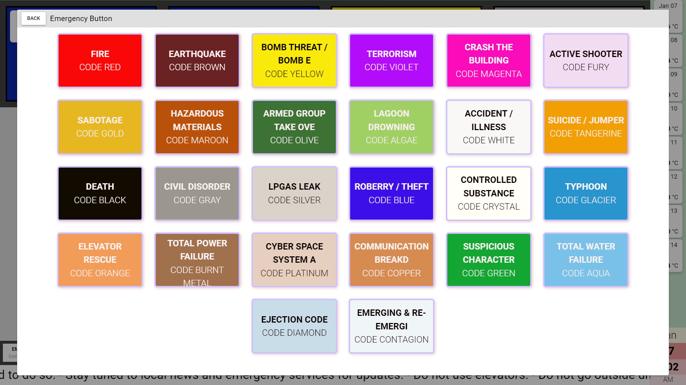

# Emergency Display and Reporting System

## Description

## Functions

### Emergency Display
- Display active emergency codes and the status level of four security-related conditions.
- Display date and time, as well as a 7-day forecast for temperature and weather.
- Display a news ticker.

### Desktop Page
- Help system: a step-by-step guide that walks the user through a certain process (*see screenshot for example*).
- Methods to report emergency: via an ***emergency button*** that users can submit in three clicks and a ***form*** that users can fill up. Each desktop page is mapped to an employee and a location, and is added to the data sent to the administrators.
- Link to download a PDF copy of the emergency manual.
- Display emergency hotline numbers.
- Mirror the data on the Emergency Display.

### Content Management System
- Create/edit/delete emergency codes.
- Activate/deactivate a certain emergency code.
- Change the status level of four security-related conditions.
- Create/delete messages that will be broadcasted in a news ticker fashion.
- View and respond to messages or emergency beacons sent by remote units. 

### SMS Notifications
- Activations of code alerts and promotions of emergency levels to a certain threshold will trigger the system to send SMS notifications to certain individuals.

## Work Done
- `DB design` - Designed database schema and created entity-relationship chart to ensure efficient data storage and relationships.
- `Interview` - Collaborated with the manager of Health and Safety Division to gather requirements and ensure system met business needs.
- `Development`
  - Developed back-end code and tested thoroughly to ensure functionality, reliability, and performance.
  - Created database, tables, views, and stored procedures
  - Integrated system to the SMS distribution system
- `Documentation` - Created comprehensive API documentation to facilitate future development and integration.
- `Deployment` - Successfully deployed system to production environment.
- `Support` - Provided training and support to team members to ensure successful adoption and usage of the system.
- `Updating` -  Assimilated system with existing systems to create a seamless user experience.

## Tech Stack
- 
-  
- 
-  
- 
- **pinia** - data management
- **axios** - API communication
- **driverJS** - help system
- **OpenWeatherMap** - weather forecast

## Screenshots
> **Desktop Page**
> 
>

> **Emergency Display**
>
>

> [!NOTE]
> More pictures on the sub-folders.